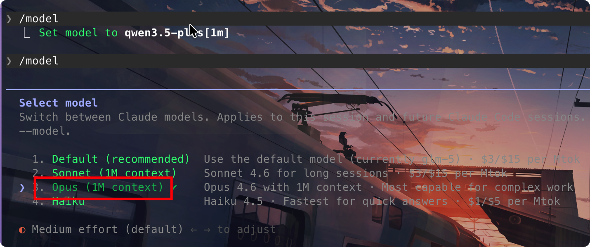
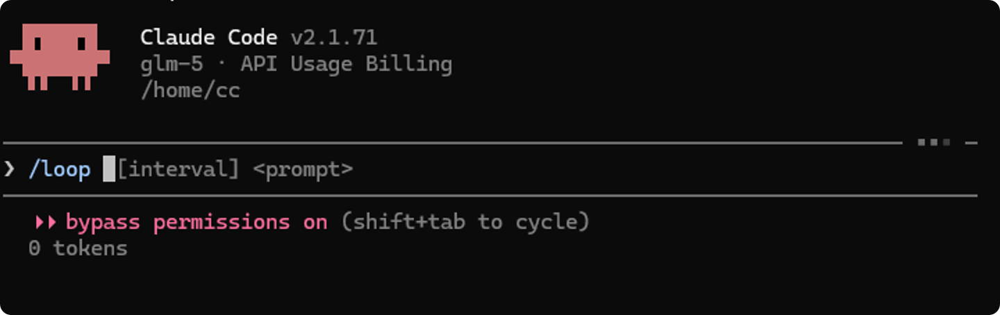
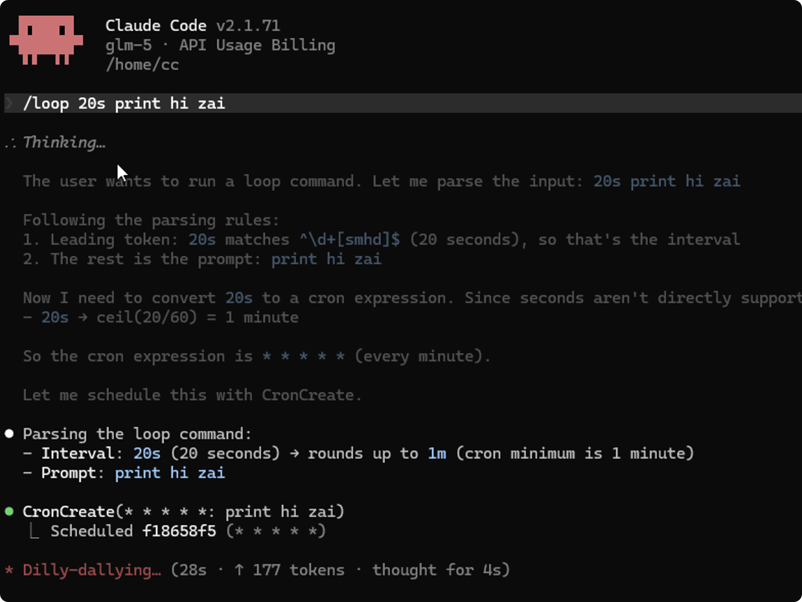

# cc-helper

[](https://www.npmjs.com/package/@unitsvc/cc-helper) [](https://github.com/next-bin/cc-helper/blob/master/LICENSE) [](https://nodejs.org) [](https://docs.anthropic.com/en/docs/claude-code)

[**English**](./README.md) | [**简体中文**](./README-zh.md)

> One command to unlock Claude Code's hidden superpowers: `/loop`, `/btw`, `/keybindings`, `/context1m`, `automode`, `monitor`, and `MCPSearch`

---

## Requirements

| Item        | Version   |
| ----------- | --------- |
| Node.js     | >= 14.0.0 |
| Claude Code | v2.1.71+  |

```bash
npm install -g @anthropic-ai/claude-code@v2.1.104
```

## Installation

Two ways to use (choose one):

```bash
# Install globally (optional)
npm install -g @unitsvc/cc-helper@latest

# Or run directly without installation
npx @unitsvc/cc-helper@latest enable
```

### Proxy Support

If download fails, use `--proxy` flag:

```bash
# Use default proxy
npx @unitsvc/cc-helper --proxy enable

# Use custom proxy
npx @unitsvc/cc-helper --proxy https://your-proxy.com enable
```

## Usage

```bash
# Enable default features (/loop, /btw, /keybindings)
npx @unitsvc/cc-helper enable

# Enable specific features
npx @unitsvc/cc-helper enable loop
npx @unitsvc/cc-helper enable btw
npx @unitsvc/cc-helper enable keybindings
npx @unitsvc/cc-helper enable toolsearch
npx @unitsvc/cc-helper enable context1m   # or: 1m, 1M
npx @unitsvc/cc-helper enable automode    # auto-mode for all models
npx @unitsvc/cc-helper enable monitor     # streaming event monitoring (v2.1.98+)

# Check status
npx @unitsvc/cc-helper status

# Disable all features
npx @unitsvc/cc-helper disable
```

## Commands

| Command              | Description                                          |
| -------------------- | ---------------------------------------------------- |
| `enable`             | Enable `/loop`, `/btw`, and `/keybindings` (default) |
| `enable loop`        | Enable only `/loop`                                  |
| `enable btw`         | Enable only `/btw`                                   |
| `enable keybindings` | Enable only `/keybindings`                           |
| `enable toolsearch`  | Enable toolsearch (requires explicit activation)     |
| `enable context1m`   | Enable 1M context for Claude Opus (v2.1.76+)         |
| `enable automode`    | Enable auto-mode for all models (v2.1.75+)           |
| `enable monitor`     | Enable Monitor tool for streaming events (v2.1.100+) |
| `disable`            | Restore original                                     |
| `status`             | Check current status with version requirements       |

> **Note**: Running `cc-helper enable` also automatically configures recommended environment variables in `~/.claude/settings.json`:
>
> ```json
> {
>   "env": {
>     "DISABLE_INSTALLATION_CHECKS": "1",
>     "DISABLE_AUTOUPDATER": "1",
>     "DISABLE_BUG_COMMAND": "1",
>     "DISABLE_ERROR_REPORTING": "1",
>     "DISABLE_TELEMETRY": "1",
>     "CLAUDE_CODE_DISABLE_NONESSENTIAL_TRAFFIC": "1",
>     "CLAUDE_CODE_DISABLE_FEEDBACK_SURVEY": "1",
>     "CLAUDE_CODE_EXPERIMENTAL_AGENT_TEAMS": "1",
>     "CLAUDE_CODE_HIDE_ACCOUNT_INFO": "1",
>     "CLAUDE_CODE_NEW_INIT": "1",
>     "CLAUDE_CODE_ATTRIBUTION_HEADER": "0",
>     "API_TIMEOUT_MS": "3000000"
>   }
> }
> ```

---

## Configuration Commands

### plan Command

Configure AI providers with vault-based secret storage.

```bash
# Add provider (auto-saves to vault + settings.json)
cc-helper plan add -p bailian -k YOUR_API_KEY
cc-helper plan add -p minimaxi -k YOUR_API_KEY --mcp

# Switch provider
cc-helper plan switch -p zai

# Switch model profile (on current provider)
cc-helper plan switch --profile 1m

# Switch provider with profile
cc-helper plan switch -p bailian -k YOUR_KEY --profile 1m

# List providers
cc-helper plan list

# Export config
cc-helper plan export --all-env -o config.json
```

**Supported Providers:**

| Provider   | Description  |
| ---------- | ------------ |
| `bailian`  | (CN) Aliyun  |
| `minimaxi` | (CN) MiniMax |
| `glm`      | (CN) Zhipu   |
| `zai`      | (EN) Zhipu   |

**Model Profiles:**

Each provider supports multiple model profiles. A profile defines mappings for all model tiers:

| Field     | Description                                       |
| --------- | ------------------------------------------------- |
| Model     | Default model (`ANTHROPIC_MODEL`)                 |
| Haiku     | Fast model (`ANTHROPIC_DEFAULT_HAIKU_MODEL`)      |
| Sonnet    | Balanced model (`ANTHROPIC_DEFAULT_SONNET_MODEL`) |
| Opus      | Powerful model (`ANTHROPIC_DEFAULT_OPUS_MODEL`)   |
| Reasoning | Extended thinking (`ANTHROPIC_REASONING_MODEL`)   |

**bailian Profiles:**

| Profile | Model        | Haiku        | Sonnet       | Opus         | Reasoning    |
| ------- | ------------ | ------------ | ------------ | ------------ | ------------ |
| default | glm-5        | glm-4.7      | glm-5        | glm-5        | glm-5        |
| 5       | glm-5        | glm-5        | glm-5        | qwen3.6-plus | glm-5        |
| 1m      | glm-5        | glm-4.7      | qwen3.5-plus | qwen3.5-plus | glm-5        |
| 3.6     | qwen3.6-plus | qwen3.6-plus | qwen3.6-plus | qwen3.6-plus | qwen3.6-plus |
| kimi    | kimi-k2.5    | kimi-k2.5    | kimi-k2.5    | kimi-k2.5    | kimi-k2.5    |
| minimax | MiniMax-M2.5 | MiniMax-M2.5 | MiniMax-M2.5 | MiniMax-M2.5 | MiniMax-M2.5 |

**glm / zai Profiles:**

| Profile | Model        | Haiku       | Sonnet  | Opus         | Reasoning    |
| ------- | ------------ | ----------- | ------- | ------------ | ------------ |
| default | glm-5        | glm-4.7     | glm-5   | glm-5        | glm-5        |
| 5       | glm-5        | glm-5-turbo | glm-5   | glm-5        | glm-5        |
| 5.1     | glm-5.1      | glm-4.7     | glm-4.7 | glm-5        | glm-5.1      |
| 5v      | glm-5v-turbo | glm-5-turbo | glm-5.1 | glm-5v-turbo | glm-5v-turbo |

**minimaxi Profiles:**

| Profile | Model        | Haiku        | Sonnet       | Opus         | Reasoning    |
| ------- | ------------ | ------------ | ------------ | ------------ | ------------ |
| default | MiniMax-M2.7 | MiniMax-M2.5 | MiniMax-M2.7 | MiniMax-M2.7 | MiniMax-M2.7 |

```bash
# Example: Use 1M context on bailian
cc-helper plan add -p bailian -k YOUR_KEY
cc-helper plan switch --profile 1m
```

### vault Command

Secure API key storage, encrypted in `cc-helper.json`.

```bash
cc-helper vault list                  # List secrets
cc-helper vault set bailian default -k "KEY"   # Set
cc-helper vault get bailian default             # Get & decrypt
cc-helper vault delete bailian default          # Delete
```

### env Command

Multiple environments (default, work, staging, etc.).

```bash
cc-helper env list    # List environments
cc-helper env create work   # Create
cc-helper env switch work   # Switch
```

### sync Command

Export/import config to Git repository with JWE encryption.

```bash
# Login to GitHub
cc-helper sync login -r https://github.com/user/repo -t ghp_xxx

# Export
cc-helper sync export
cc-helper sync export --file config.json
cc-helper sync export --workspace test

# Import
cc-helper sync import
```

---

## Core Features

### `/loop` - Scheduled Recurring Prompts

Schedule prompts for polling deployments, babysitting PRs, setting reminders, or running workflows on an interval.

```
/loop [interval] <prompt>
```

**Examples:**

```
/loop 5m check if the deployment finished
/loop 30m /review-pr 1234
/loop remind me to push the release at 3pm
```

| Form             | Example                     | Parsed Interval        |
| ---------------- | --------------------------- | ---------------------- |
| Leading token    | `/loop 30m check`           | every 30 minutes       |
| Trailing `every` | `/loop check every 2 hours` | every 2 hours          |
| No interval      | `/loop check`               | defaults to 10 minutes |

Supported units: `s` (seconds), `m` (minutes), `h` (hours), `d` (days)

**Key Features:**

- **Session-scoped**: Tasks live in the current session and disappear on exit
- **Auto-expiry**: Tasks expire after 3 days
- **Jitter protection**: Small offsets prevent API thundering herd
- **Low priority**: Fires between your turns, not while Claude is busy

```
what scheduled tasks do I have?   # List all tasks
cancel the deploy check job       # Cancel by description or ID
```

### `/btw` - Side Questions

Ask side questions without disrupting the main conversation flow.

```
/btw <question>
```

**Examples:**

```
/btw what does this function do?
/btw explain the error handling here
/btw why use async/await in this case?
```

### `/keybindings` - Custom Keyboard Shortcuts

Configure in `~/.claude/keybindings.json`:

```json
{
  "submit": ["ctrl+s"],
  "interrupt": ["ctrl+c"],
  "custom_commands": {
    "ctrl+shift+l": "/loop 5m check status"
  }
}
```

### `/context1m` - 1M Token Context

Enable 1M token context window for Claude Opus models.

**Requirements:**

- Claude Code v2.1.76 or higher
- Claude Opus 4+ model
- May require Pro plan or first-party API



**Extended Thinking & Context Length:**

| Model                | Max Thinking Tokens | Context Length |
| -------------------- | ------------------: | -------------: |
| qwen3.6-plus         |              81,920 |      1,000,000 |
| qwen3.5-plus         |              81,920 |      1,000,000 |
| qwen3-coder-plus     |       Not supported |      1,000,000 |
| qwen3-max-2026-01-23 |              81,920 |        262,144 |
| qwen3-coder-next     |       Not supported |        262,144 |
| kimi-k2.5            |              81,920 |        262,144 |
| MiniMax-M2.5         |              32,768 |        204,800 |
| glm-5                |              32,768 |        202,752 |
| glm-4.7              |              32,768 |        202,752 |

### Tool Search

Dynamically search and load tools at runtime instead of sending all tool definitions upfront. Saves tokens and improves performance.

**Why Third-Party APIs?** Claude Code disables Tool Search for third-party proxies by default. This feature enables it.

**Benefits:**

- **Token efficiency**: Reduces context usage for large MCP tool catalogs
- **Better performance**: Faster response with deferred loading
- **Proxy compatibility**: Works with Kimi and other providers

**Requirements:**

- Proxy must support `tool_reference` blocks
- Claude Sonnet 4+ or Opus 4+ models only (not Haiku)

Control via `ENABLE_TOOL_SEARCH` environment variable:

| Value      | Behavior                                            |
| ---------- | --------------------------------------------------- |
| (unset)    | Default enabled, disabled for non-first-party hosts |
| `true`     | Always enabled                                      |
| `auto`     | Activates when MCP tools exceed 10% of context      |
| `auto:<N>` | Custom threshold (e.g., `auto:5` for 5%)            |
| `false`    | Disabled, all tools loaded upfront                  |

```bash
ENABLE_TOOL_SEARCH=auto:5 claude   # 5% threshold
ENABLE_TOOL_SEARCH=false claude   # Disable
ENABLE_TOOL_SEARCH=true claude    # Always enable
```

Disable MCPSearch Tool:

```json
{
  "permissions": {
    "deny": ["MCPSearch"]
  }
}
```

### Auto Mode

Enable auto-mode for all models and API types, bypassing model restrictions.

**Why Enable?** Claude Code restricts auto-mode to specific models (Opus/Sonnet 4.6) and first-party APIs only. This feature enables it for all models and third-party proxies.

**Benefits:**

- **Universal access**: Auto-mode works with any model
- **Proxy support**: Compatible with Bedrock, Vertex, and third-party APIs
- **No restrictions**: Bypasses remote config control

**Requirements:**

- Claude Code v2.1.75 or higher

```bash
npx @unitsvc/cc-helper enable automode
```

**Environment Variables:**

| Variable                        | Description                     |
| ------------------------------- | ------------------------------- |
| `CC_HELPER_AUTO_MODE_MODEL`     | Custom classifier model         |
| `ANTHROPIC_DEFAULT_HAIKU_MODEL` | Fallback model if not specified |

### Monitor

Enable the Monitor tool for streaming event monitoring.

**Benefits:**

- **Streaming monitoring**: Watch logs, file changes, API events in real-time
- **Event-driven workflow**: Respond to events as they arrive
- **Persistent monitoring**: Run long-lived monitors during the session

**Requirements:**

- Claude Code v2.1.100 or higher

```bash
npx @unitsvc/cc-helper enable monitor
```

**Examples:**

```bash
# Monitor log file for errors
tail -f /var/log/app.log | grep --line-buffered "ERROR"

# Watch for file changes
inotifywait -m --format '%e %f' /watched/dir

# Poll GitHub for new PR comments
while true; do
  gh api "repos/owner/repo/issues/123/comments?since=$last" --jq '.[].body'
  sleep 30
done
```

---

## Features

| Feature            | Description                                                   |
| ------------------ | ------------------------------------------------------------- |
| One-command enable | Enable `/loop`, `/btw`, `/keybindings` with one command       |
| Tool Search        | Optional `/toolsearch` for third-party API proxies            |
| 1M Context         | Optional `/context1m` for 1M context (v2.1.76+)               |
| Auto Mode          | Optional `automode` for all models (v2.1.75+)                 |
| Monitor            | Optional `monitor` for streaming event monitoring (v2.1.100+) |
| Provider config    | `plan` command with vault-based API key storage               |
| Secret management  | `vault` command for secure secret storage                     |
| Multi-environment  | `env` command for environment switching                       |
| Git sync           | `sync` command for configuration sync                         |
| Easy restore       | Automatic backup and restore                                  |
| Zero dependencies  | No runtime dependencies                                       |

### Screenshots




## Platforms

| Platform | Architecture |
| -------- | ------------ |
| macOS    | amd64, arm64 |
| Linux    | amd64, arm64 |
| Windows  | amd64, arm64 |

## License

AGPL-3.0 - see [LICENSE](./LICENSE)

## Security

### Reporting Vulnerabilities

If you discover a security vulnerability, please report it responsibly:

1. **Do not** open a public issue
2. Send an email to the maintainer with details
3. Allow reasonable time for the issue to be addressed before public disclosure

We take security seriously and will respond to reports as quickly as possible.
