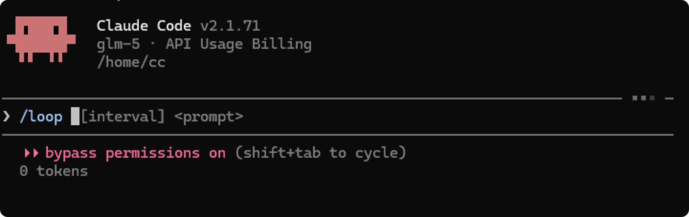
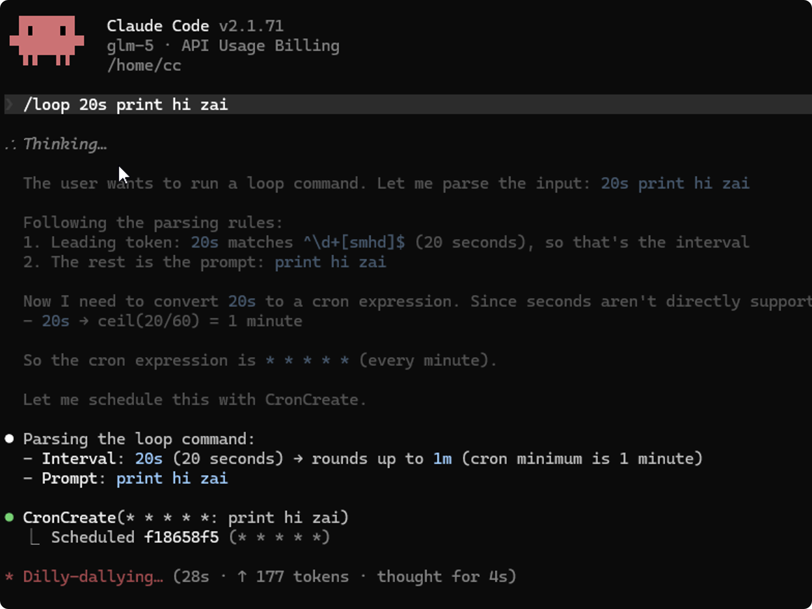
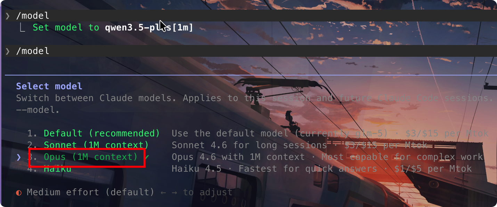

<div align="center">

# CC-Helper

### The All-in-One Assistant & Provider Manager for Claude Code & Codex

[](https://www.npmjs.com/package/@unitsvc/cc-helper)
[](https://www.npmjs.com/package/@unitsvc/cc-helper)
[](https://github.com/next-bin/cc-helper)
[](https://github.com/next-bin/cc-helper/blob/master/LICENSE)

English | [简体中文](README-zh.md)

</div>

> **⚠️ Disclaimer:** Zhipu (glm/zai) company and its associated products are **NOT** permitted to use this software.

---

## Requirements

| Item        | Version   |
| ----------- | --------- |
| Node.js     | >= 14.0.0 |
| Claude Code | v2.1.71+  |
| Codex       | 0.80.0+   |

```bash
npm install -g @anthropic-ai/claude-code@v2.1.112
npm install -g @openai/codex@latest
```

## Installation

```bash
npm install -g @unitsvc/cc-helper@latest
```

## Update

```bash
npm install -g @unitsvc/cc-helper@latest
# or
cc-helper update
```

### Proxy Support

If download fails, use `--dl-proxy` flag:

```bash
# Use default proxy
cc-helper --dl-proxy enable

# Use custom proxy
cc-helper --dl-proxy https://your-proxy.com enable
```

> **Note**: `--proxy` is still supported for backward compatibility but is deprecated. Use `--dl-proxy` instead.

---

## Quick Start

```bash
# Enable default features (/loop, /btw, /keybindings)
cc-helper enable

# Enable specific features
cc-helper enable loop        # scheduled recurring prompts
cc-helper enable btw         # side questions
cc-helper enable keybindings # custom keyboard shortcuts
cc-helper enable toolsearch  # dynamic tool search
cc-helper enable context1m   # 1M token context (v2.1.76+)
cc-helper enable automode    # auto-mode for all models (v2.1.75+)
cc-helper enable monitor     # streaming event monitoring (v2.1.100+)

# Check status
cc-helper status

# Disable all features
cc-helper disable
```

> **Note**: Running `cc-helper enable` also automatically configures recommended environment variables in `~/.claude/settings.json`:
>
> <details>
> <summary>View environment variables</summary>
>
> ```json
> {
>   "env": {
>     "DISABLE_INSTALLATION_CHECKS": "1",
>     "DISABLE_AUTOUPDATER": "1",
>     "DISABLE_BUG_COMMAND": "1",
>     "DISABLE_ERROR_REPORTING": "1",
>     "DISABLE_TELEMETRY": "1",
>     "CLAUDE_CODE_DISABLE_NONESSENTIAL_TRAFFIC": "1",
>     "CLAUDE_CODE_DISABLE_FEEDBACK_SURVEY": "1",
>     "CLAUDE_CODE_EXPERIMENTAL_AGENT_TEAMS": "1",
>     "CLAUDE_CODE_HIDE_ACCOUNT_INFO": "1",
>     "CLAUDE_CODE_NEW_INIT": "1",
>     "CLAUDE_CODE_ATTRIBUTION_HEADER": "0",
>     "API_TIMEOUT_MS": "3000000"
>   }
> }
> ```
>
> </details>

---

## Configuration Commands

Manage AI provider settings, API keys, environments, and configuration sync for Claude Code.

### plan — Coding Plan Provider

Configure third-party AI providers for coding plans with vault-encrypted API key storage. Supports custom model profiles for different coding scenarios.

```bash
# Add provider (auto-saves to vault + settings.json)
cc-helper plan add -p bailian -k YOUR_API_KEY
cc-helper plan add -p minimaxi -k YOUR_API_KEY --mcp

# Switch provider
cc-helper plan switch -p bailian

# Switch model profile (on current provider)
cc-helper plan switch --profile 1m

# Switch provider with profile
cc-helper plan switch -p bailian -k YOUR_KEY --profile 1m

# List providers
cc-helper plan list

# Export config
cc-helper plan export --all-env -o config.json
```

**1M Context Tag:**

Use `--1m` flag to add `[1m]` context tag to model fields, indicating models with 1M token context window support.

> **Note**: `[1m]` tag requires Claude Code v2.1.118 or later.

| Flag       | Behavior                             |
| ---------- | ------------------------------------ |
| No `--1m`  | No `[1m]` tags added                 |
| `--1m d`   | Use `Context1M` from profile config  |
| `--1m o`   | Override config, tag only opus       |
| `--1m s,o` | Override config, tag sonnet and opus |

Shorthand: `m=model, h=haiku, s=sonnet, o=opus, r=reasoning`, `d=default (use config)`

```bash
# Example: Switch to 1m profile with default 1M fields
cc-helper plan switch --profile 1m --1m d

# Example: Switch to 3.6 profile, tag only opus
cc-helper plan switch --profile 3.6 --1m o

# Example: Switch provider and tag sonnet, opus
cc-helper plan switch -p bailian --profile 1m --1m s,o
```

**Supported Providers:**

| Provider    | Description          |
| ----------- | -------------------- |
| `bailian`   | (CN) Aliyun          |
| `minimaxi`  | (CN) MiniMax         |
| `ark`       | (CN) Ark Coding Plan |
| `ark-agent` | (CN) Ark Agent Plan  |
| `xiaomi`    | (CN) Xiaomi MiMo     |
| `deepseek`  | DeepSeek             |
| ~~`glm`~~   | ~~(CN) Zhipu~~       |
| ~~`zai`~~   | ~~(EN) Zhipu~~       |

**Model Profiles:**

Each provider supports multiple model profiles. A profile defines mappings for all model tiers:

| Field     | Description                                       |
| --------- | ------------------------------------------------- |
| Model     | Default model (`ANTHROPIC_MODEL`)                 |
| Haiku     | Fast model (`ANTHROPIC_DEFAULT_HAIKU_MODEL`)      |
| Sonnet    | Balanced model (`ANTHROPIC_DEFAULT_SONNET_MODEL`) |
| Opus      | Powerful model (`ANTHROPIC_DEFAULT_OPUS_MODEL`)   |
| Reasoning | Extended thinking (`ANTHROPIC_REASONING_MODEL`)   |

**bailian Profiles:**

<details>
<summary>View bailian model profiles</summary>

| Profile | Model        | Haiku        | Sonnet       | Opus         | Reasoning    | Context1M   |
| ------- | ------------ | ------------ | ------------ | ------------ | ------------ | ----------- |
| default | glm-5        | glm-4.7      | glm-5        | glm-5        | glm-5        | -           |
| 5       | glm-5        | glm-5        | glm-5        | qwen3.7-plus | glm-5        | opus        |
| 1m      | glm-5        | glm-5        | qwen3.7-plus | qwen3.7-plus | glm-5        | sonnet,opus |
| 3.6     | qwen3.6-plus | qwen3.6-plus | qwen3.6-plus | qwen3.6-plus | qwen3.6-plus | sonnet,opus |
| 3.7     | qwen3.7-plus | qwen3.7-plus | qwen3.7-plus | qwen3.7-plus | qwen3.7-plus | sonnet,opus |
| qwen    | qwen3.7-plus | qwen3.7-plus | qwen3.7-plus | qwen3.7-plus | qwen3.7-plus | sonnet,opus |
| glm     | glm-5        | glm-5        | glm-5        | glm-5        | glm-5        | -           |
| kimi    | kimi-k2.5    | kimi-k2.5    | kimi-k2.5    | kimi-k2.5    | kimi-k2.5    | -           |
| minimax | MiniMax-M2.5 | MiniMax-M2.5 | MiniMax-M2.5 | MiniMax-M2.5 | MiniMax-M2.5 | -           |

</details>

**minimaxi Profiles:**

<details>
<summary>View minimaxi model profiles</summary>

| Profile | Model        | Haiku                  | Sonnet       | Opus         | Reasoning    | Context1M   |
| ------- | ------------ | ---------------------- | ------------ | ------------ | ------------ | ----------- |
| default | MiniMax-M3   | MiniMax-M2.7-highspeed | MiniMax-M3   | MiniMax-M3   | MiniMax-M3   | sonnet,opus |
| 2.7     | MiniMax-M2.7 | MiniMax-M2.7-highspeed | MiniMax-M2.7 | MiniMax-M2.7 | MiniMax-M2.7 | -           |
| 3       | MiniMax-M3   | MiniMax-M3             | MiniMax-M3   | MiniMax-M3   | MiniMax-M3   | sonnet,opus |

</details>

**ark Profiles:**

<details>
<summary>View ark model profiles</summary>

| Profile  | Model               | Haiku                | Sonnet               | Opus                | Reasoning           | Context1M   |
| -------- | ------------------- | -------------------- | -------------------- | ------------------- | ------------------- | ----------- |
| default  | kimi-k2.6           | kimi-k2.6            | kimi-k2.6            | kimi-k2.6           | kimi-k2.6           | -           |
| kimi     | kimi-k2.6           | kimi-k2.6            | kimi-k2.6            | kimi-k2.6           | kimi-k2.6           | -           |
| doubao   | doubao-seed-2.0-pro | doubao-seed-2.0-lite | doubao-seed-2.0-code | doubao-seed-2.0-pro | doubao-seed-2.0-pro | -           |
| minimax  | minimax-m3          | minimax-m3           | minimax-m3           | minimax-m3          | minimax-m3          | sonnet,opus |
| glm      | glm-5.2             | glm-5.2              | glm-5.2              | glm-5.2             | glm-5.2             | sonnet,opus |
| deepseek | deepseek-v4-pro     | deepseek-v4-flash    | deepseek-v4-pro      | deepseek-v4-pro     | deepseek-v4-pro     | sonnet,opus |
| auto     | glm-5.2             | ark-code-latest      | deepseek-v4-pro      | glm-5.2             | kimi-k2.7-code      | -           |

</details>

**ark-agent Profiles:**

<details>
<summary>View ark-agent model profiles</summary>

| Profile  | Model               | Haiku                | Sonnet               | Opus                | Reasoning           | Context1M   |
| -------- | ------------------- | -------------------- | -------------------- | ------------------- | ------------------- | ----------- |
| default  | glm-5.2             | glm-5.2              | glm-5.2              | glm-5.2             | glm-5.2             | -           |
| deepseek | deepseek-v4-pro     | deepseek-v4-flash    | deepseek-v4-pro      | deepseek-v4-pro     | deepseek-v4-pro     | sonnet,opus |
| doubao   | doubao-seed-2.0-pro | doubao-seed-2.0-lite | doubao-seed-2.0-code | doubao-seed-2.0-pro | doubao-seed-2.0-pro | -           |
| glm      | glm-5.2             | glm-5.2              | glm-5.2              | glm-5.2             | glm-5.2             | sonnet,opus |
| kimi     | kimi-k2.6           | kimi-k2.6            | kimi-k2.6            | kimi-k2.6           | kimi-k2.6           | -           |
| minimax  | minimax-m3          | minimax-m3           | minimax-m3           | minimax-m3          | minimax-m3          | sonnet,opus |

</details>

**xiaomi Profiles:**

<details>
<summary>View xiaomi model profiles</summary>

| Profile    | Model           | Haiku           | Sonnet          | Opus            | Reasoning       | Context1M   |
| ---------- | --------------- | --------------- | --------------- | --------------- | --------------- | ----------- |
| default    | mimo-v2.5-pro   | mimo-v2.5-flash | mimo-v2.5-pro   | mimo-v2.5-pro   | mimo-v2.5-pro   | sonnet,opus |
| pro        | mimo-v2.5-pro   | mimo-v2.5-pro   | mimo-v2.5-pro   | mimo-v2.5-pro   | mimo-v2.5-pro   | sonnet,opus |
| v2.5       | mimo-v2.5       | mimo-v2.5       | mimo-v2.5       | mimo-v2.5       | mimo-v2.5       | -           |
| v2.5-flash | mimo-v2.5-flash | mimo-v2.5-flash | mimo-v2.5-flash | mimo-v2.5-flash | mimo-v2.5-flash | -           |
| v2         | mimo-v2-pro     | mimo-v2-omni    | mimo-v2-pro     | mimo-v2-pro     | mimo-v2-pro     | sonnet,opus |
| omni       | mimo-v2.5       | mimo-v2-omni    | mimo-v2.5       | mimo-v2.5       | mimo-v2.5       | -           |

</details>

**deepseek Profiles:**

<details>
<summary>View deepseek model profiles</summary>

| Profile | Model             | Haiku             | Sonnet            | Opus              | Reasoning         |
| ------- | ----------------- | ----------------- | ----------------- | ----------------- | ----------------- |
| default | deepseek-v4-pro   | deepseek-v4-flash | deepseek-v4-pro   | deepseek-v4-pro   | deepseek-v4-pro   |
| flash   | deepseek-v4-flash | deepseek-v4-flash | deepseek-v4-flash | deepseek-v4-flash | deepseek-v4-flash |
| pro     | deepseek-v4-pro   | deepseek-v4-pro   | deepseek-v4-pro   | deepseek-v4-pro   | deepseek-v4-pro   |

</details>

**~~glm / zai Profiles:~~ (NOT ALLOWED)**

<details>
<summary>View glm/zai model profiles (deprecated)</summary>

| Profile | Model        | Haiku        | Sonnet  | Opus    | Reasoning |
| ------- | ------------ | ------------ | ------- | ------- | --------- |
| default | glm-5.1      | qwen3.7-plus | glm-5.1 | glm-5.1 | glm-5.1   |
| 5       | glm-5        | glm-5-turbo  | glm-5   | glm-5   | glm-5     |
| 5.1     | glm-5.1      | qwen3.7-plus | glm-5.1 | glm-5.1 | glm-5.1   |
| 5v      | glm-5v-turbo | qwen3.7-plus | glm-5.1 | glm-5.1 | glm-5.1   |

</details>

```bash
# Example: Use 1M context on bailian
cc-helper plan add -p bailian -k YOUR_KEY
cc-helper plan switch --profile 1m

# Example: Configure Ark with auto profile
cc-helper plan add -p ark -k YOUR_KEY
cc-helper plan switch --profile auto
```

### Multi-Window Configuration

Use `config claude` to generate temporary settings for running multiple Claude Code windows with different providers/models:

```bash
eval "$(cc-helper config claude -p bailian)"                                        # Window 1: bailian
eval "$(cc-helper config claude -p minimaxi)"                                       # Window 2: minimaxi
eval "$(cc-helper config claude -p glm --profile 5.1 --permission-mode auto)"       # Window 3: glm + auto permission
eval "$(cc-helper config claude -p bailian --proxy --profile 1m)"                   # Window 4: bailian via proxy
```

**Parameters:**

| Parameter           | Description                                            |
| ------------------- | ------------------------------------------------------ |
| `-p, --provider`    | Provider ID (bailian, minimaxi, glm, zai, ark, xiaomi) |
| `--profile`         | Model profile (e.g., 5.1, default, kimi)               |
| `--name`            | Key name                                               |
| `--api`             | Use API key mode                                       |
| `--1m`              | 1M context tag                                         |
| `--proxy`           | Use proxy mode (localhost:12315)                       |
| `--port`            | Custom proxy port (default: 12315, range: 1-65535)     |
| `--permission-mode` | Permission mode (bypass, auto, acceptEdits, plan)      |
| `--json`            | JSON format output                                     |

### vault — Secure API Key Storage

Store and retrieve provider API keys locally with encryption.

```bash
cc-helper vault list                              # List secrets
cc-helper vault set bailian default -k "KEY"      # Set
cc-helper vault get bailian default               # Get & decrypt
cc-helper vault delete bailian default            # Delete
```

### env — Environment Management

Create and switch between isolated configuration environments.

```bash
cc-helper env list                     # List environments
cc-helper env create work              # Create
cc-helper env switch work              # Switch
```

### sync — Config Sync with Git

Backup and restore Claude Code configuration to a Git repository with end-to-end encryption.

```bash
# Login to GitHub
cc-helper sync login -r https://github.com/user/repo -t ghp_xxx

# Export
cc-helper sync export
cc-helper sync export --file config.json
cc-helper sync export --workspace test

# Import
cc-helper sync import
```

---

## Features

| Feature            | Description                                                   |
| ------------------ | ------------------------------------------------------------- |
| One-command enable | Enable `/loop`, `/btw`, `/keybindings` with one command       |
| Tool Search        | Optional `/toolsearch` for third-party API proxies            |
| 1M Context         | Optional `/context1m` for 1M context (v2.1.76+)               |
| Auto Mode          | Optional `automode` for all models (v2.1.75+)                 |
| Monitor            | Optional `monitor` for streaming event monitoring (v2.1.100+) |
| Provider config    | `plan` command with vault-based API key storage               |
| Secret management  | `vault` command for secure secret storage                     |
| Multi-environment  | `env` command for environment switching                       |
| Git sync           | `sync` command for configuration sync                         |
| Easy restore       | Automatic backup and restore                                  |
| Zero dependencies  | No runtime dependencies                                       |

### Screenshots




## Platforms

| Platform | Architecture |
| -------- | ------------ |
| macOS    | amd64, arm64 |
| Linux    | amd64, arm64 |
| Windows  | amd64, arm64 |

---

## Core Features

### `/loop` - Scheduled Recurring Prompts

Schedule prompts for polling deployments, babysitting PRs, setting reminders, or running workflows on an interval.

```
/loop [interval] <prompt>
```

**Examples:**

```
/loop 5m check if the deployment finished
/loop 30m /review-pr 1234
/loop remind me to push the release at 3pm
```

| Form             | Example                     | Parsed Interval        |
| ---------------- | --------------------------- | ---------------------- |
| Leading token    | `/loop 30m check`           | every 30 minutes       |
| Trailing `every` | `/loop check every 2 hours` | every 2 hours          |
| No interval      | `/loop check`               | defaults to 10 minutes |

Supported units: `s` (seconds), `m` (minutes), `h` (hours), `d` (days)

**Key Features:**

- **Session-scoped**: Tasks live in the current session and disappear on exit
- **Auto-expiry**: Tasks expire after 3 days
- **Jitter protection**: Small offsets prevent API thundering herd
- **Low priority**: Fires between your turns, not while Claude is busy

```
what scheduled tasks do I have?   # List all tasks
cancel the deploy check job       # Cancel by description or ID
```

### `/btw` - Side Questions

Ask side questions without disrupting the main conversation flow.

```
/btw <question>
```

**Examples:**

```
/btw what does this function do?
/btw explain the error handling here
/btw why use async/await in this case?
```

### `/keybindings` - Custom Keyboard Shortcuts

Configure in `~/.claude/keybindings.json`:

```json
{
  "submit": ["ctrl+s"],
  "interrupt": ["ctrl+c"],
  "custom_commands": {
    "ctrl+shift+l": "/loop 5m check status"
  }
}
```

### `/context1m` - 1M Token Context

Enable 1M token context window for Claude Opus models.

**Requirements:**

- Claude Code v2.1.76 or higher
- Claude Opus 4+ model
- May require Pro plan or first-party API



**Extended Thinking & Context Length:**

<details>
<summary>View context length table</summary>

| Model                | Max Thinking Tokens | Context Length |
| -------------------- | ------------------: | -------------: |
| qwen3.7-plus         |             262,144 |      1,000,000 |
| qwen3.6-plus         |              81,920 |      1,000,000 |
| qwen3.5-plus         |              81,920 |      1,000,000 |
| qwen3-coder-plus     |       Not supported |      1,000,000 |
| qwen3-max-2026-01-23 |              81,920 |        262,144 |
| qwen3-coder-next     |       Not supported |        262,144 |
| kimi-k2.5            |              81,920 |        262,144 |
| MiniMax-M2.5         |              32,768 |        204,800 |
| glm-5                |              32,768 |        202,752 |
| glm-4.7              |              32,768 |        202,752 |

</details>

### Tool Search

Dynamically search and load tools at runtime instead of sending all tool definitions upfront. Saves tokens and improves performance.

**Why Third-Party APIs?** Claude Code disables Tool Search for third-party proxies by default. This feature enables it.

**Benefits:**

- **Token efficiency**: Reduces context usage for large MCP tool catalogs
- **Better performance**: Faster response with deferred loading
- **Proxy compatibility**: Works with Kimi and other providers

**Requirements:**

- Proxy must support `tool_reference` blocks
- Claude Sonnet 4+ or Opus 4+ models only (not Haiku)

Control via `ENABLE_TOOL_SEARCH` environment variable:

| Value      | Behavior                                            |
| ---------- | --------------------------------------------------- |
| (unset)    | Default enabled, disabled for non-first-party hosts |
| `true`     | Always enabled                                      |
| `auto`     | Activates when MCP tools exceed 10% of context      |
| `auto:<N>` | Custom threshold (e.g., `auto:5` for 5%)            |
| `false`    | Disabled, all tools loaded upfront                  |

```bash
ENABLE_TOOL_SEARCH=auto:5 claude   # 5% threshold
ENABLE_TOOL_SEARCH=false claude   # Disable
ENABLE_TOOL_SEARCH=true claude    # Always enable
```

Disable MCPSearch Tool:

```json
{
  "permissions": {
    "deny": ["MCPSearch"]
  }
}
```

### Auto Mode

Enable auto-mode for all models and API types, bypassing model restrictions.

**Why Enable?** Claude Code restricts auto-mode to specific models (Opus/Sonnet 4.6) and first-party APIs only. This feature enables it for all models and third-party proxies.

**Benefits:**

- **Universal access**: Auto-mode works with any model
- **Proxy support**: Compatible with Bedrock, Vertex, and third-party APIs
- **No restrictions**: Bypasses remote config control

**Requirements:**

- Claude Code v2.1.75 or higher

```bash
cc-helper enable automode
```

**Environment Variables:**

| Variable                        | Description                     |
| ------------------------------- | ------------------------------- |
| `CC_HELPER_AUTO_MODE_MODEL`     | Custom classifier model         |
| `ANTHROPIC_DEFAULT_HAIKU_MODEL` | Fallback model if not specified |

### Monitor

Enable the Monitor tool for streaming event monitoring.

**Benefits:**

- **Streaming monitoring**: Watch logs, file changes, API events in real-time
- **Event-driven workflow**: Respond to events as they arrive
- **Persistent monitoring**: Run long-lived monitors during the session

**Requirements:**

- Claude Code v2.1.98 or higher

```bash
cc-helper enable monitor
```

**Examples:**

```bash
# Monitor log file for errors
tail -f /var/log/app.log | grep --line-buffered "ERROR"

# Watch for file changes
inotifywait -m --format '%e %f' /watched/dir

# Poll GitHub for new PR comments
while true; do
  gh api "repos/owner/repo/issues/123/comments?since=$last" --jq '.[].body'
  sleep 30
done
```

## License

AGPL-3.0 - see [LICENSE](./LICENSE)

## Security

### Reporting Vulnerabilities

If you discover a security vulnerability, please report it responsibly:

1. **Do not** open a public issue
2. Send an email to the maintainer with details
3. Allow reasonable time for the issue to be addressed before public disclosure

We take security seriously and will respond to reports as quickly as possible.
